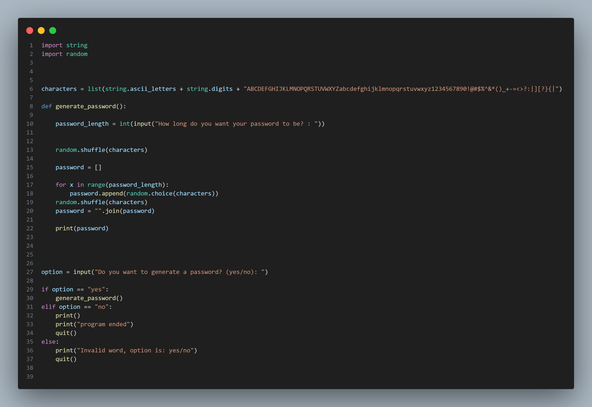

# Random-password-generator

To create a Random-password-generator, you need to follow these steps:

1. Import string, then import random. Then create a variable(characters) then turn it into a list then put some random numbers (in mine i put all the letters,numbers and signs). Create a def function and put a function there(generate_password). Then create a variable(password_length), then turn it into an int, and put an input, then ask the user a question(int(input("How long do you want your password to be? : ")))
2. Shuffle the variable(random.shuffle(characters)). Create a var(password), then put an empty list. Create a for loop(for x in range(password_length:)), then append the var(password.append(random.choice(characters))). Shuffle the var again(random.shuffle(characters))
3. Join the var(password = "".join(password)).Then print the var(password). Create a var(options), Then ask the user if they wan to generate a password or not(option = input("Do you want to generate a password? (yes/no): "))
4. Create an if statement of if the user option is 'yes'(if option == "yes":), then print out the def function(generate password()).Create an elif statement of if the user option is 'no' quit(elif option == "no":
quit())
5. Create an else statement to print something like invalid word(print("Invalid word, option is: yes/no")), then quit()

If you don't understand look at the image; 